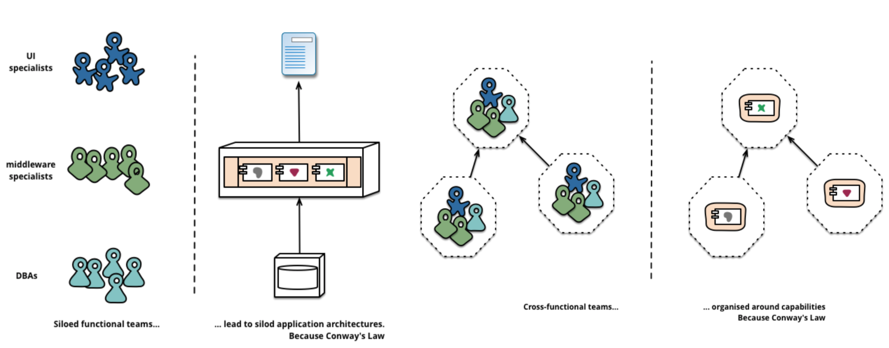

## Team Structure
Team structure is reflected in a service’s architecture with the roles below for a web application development team: 
* UX designer: Standardization of UI/UX for the company’s brand.
* FED(Front End Developer):Static views implementation, decouple with the data provided from the services. 
* BED(Back End Developer): Services implementation and maintenance.
* Tester: Manual and automatic tests to ensure the quality of UI, security, performance, etc. 
* DevOps: CI/CD infrastructure (Infrastructure as Code) and application-operation monitoring.

目前的问题：
* 缺少UX人员，导致用户体验不统一。
* 缺少前端开发。
* 前后端没有分离，导致数据绑定到页面：前端无法独立开发页面，后端无法独立实现微服务接口。
* 测试指标应该明确，比如UI测试，安全测试，性能测试等。
* 没有运维人员，导致本地环境=开发环境=测试环境=生产环境；部署不是代码化，而是手动进行；没有健康监控。

提升性能的简单一步：
* 使用HTTP/2。
* 使用GZip压缩静态文件，比如HTML, CSS和JavaScript。
* 使用浏览器Cache静态文件。
* 前端使用Responsive Design。
* 图片使用Adaptive Image。

## Microservice Architecture
The Microservice architecture includes modules as below:
* API Gateway: Web applications can scale easily in response to load and performance bottleneck with products like Nginx, Apache, Netflix Zuul, Spring Cloud Gateway, Linkerd, Envoy, Undertow, Gatling.
* Cache: Redis, Varnish or Memcached can maintain session state for days, weeks and months to keey track of states while users interact with multiple stateless services or store the transient real-time data. 

### Network Infrastructure 

目前的问题：
* 没有生产环境的部署，或者说生产环境直接等于本地环境。比如DNS服务缺失，导致IP和端口直接暴露；没有HTTPS，无法保证会话安全；没有API Gateway和Cache部署，导致性能瓶颈。

## Continuous Integration and Continuous Delivery
CI/CD (Continuous Integration/Continuous Delivery)’s benefits are as below:
* Developers should focus on the implementation of services, rather than on the environments and releases.
* Deploy as early and often as possible, e.g. micro deployment.
* Tests should be automated.

目前的问题：
* 没有代码化部署，部署是开发人员手动进行。应该更好的运用Maven，Jenkins及其他工具，自动化管理代码规范，测试/生产环境版本和部署。
* 对腾讯云，阿里云，政务云和Spring Cloud的集成，我们需要尽早部署生产环境，以便排查集成问题。

## Skill Set:
We need to systematically uplift FED/BED/DevOps capabilities towards the Microservice landscape, and the roadmap is as below for each role:

### Microservice landscape

### Frontend Roadmap

### Back-end Roadmap

### DevOps Roadmap

## Reference
* https://engineering.opsgenie.com/comparing-api-gateway-performances-nginx-vs-zuul-vs-spring-cloud-gateway-vs-linkerd-b2cc59c65369
* https://martinfowler.com/articles/microservices.html
* https://microservices.io/patterns/microservices.html
* https://microservices.io/articles/whoisusingmicroservices.html

## Blog
* http://chrisrichardson.net/post/microservices/general/2019/02/16/whats-a-service-part-1.html
* https://martinfowler.com/
* https://microservices.io/
* https://12factor.net/
